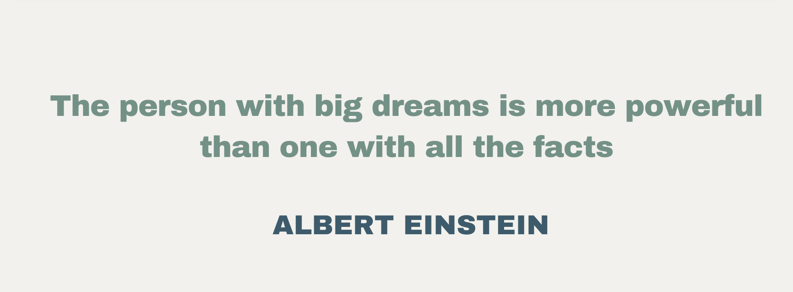

# Data & AI Analytics
#### Technical Skills: Python, SQL, R, GCP, Azure, Power BI, Tableau

## Education
**MSc Applied Social Data Science | London School of Economics and Political Science (_1st Class with Distinction_)**\
Activities and societies: LSESU Machine Learning Society
  
**BA Politics and Economics | Waseda University**\
Activities and societies:　Waseda Piano Society 早大ピアノの会
  
  
## Work Experience
**Data & AI Analytics Analyst | Accenture (London, UK)\
Summer Insight | McKinsey & Co. (Tokyo, Japan)**

## Publication
- [The Future Technology of Inflation Forecasting: Text Sentiment Analysis via a Designed Lexical Corpus(2020)](http://www.snbperi.org/article/83)

## Certifications
- Microsoft Power BI Data Analyst Associate PL300		| 	passed		 	(_2024_)
- Japanese Language Proficiency Test, Level N1(highest level)	| 180/180(full marks) 	(_2023_)
- Google Cloud Digital Leader Certification				| 	passed			(_2022_)
- AI Explained, Coursera					| 			passed (_2022_)

## Languages:
- English
- Mandarin
- Japanese

## 🎹 Piano 
As a hobby, I enjoy playing the piano and have mastered some iconic classical pieces. Below are the pieces I have ever performed in public, including at charity events, school performances, and company gatherings:
- Frédéric Chopin: Étude in E major, Op. 10, No. 3 ('Tristesse')
- Frédéric Chopin: Waltz in D-flat major, Op. 64, No. 1 (‘Valse du petit chien’)

